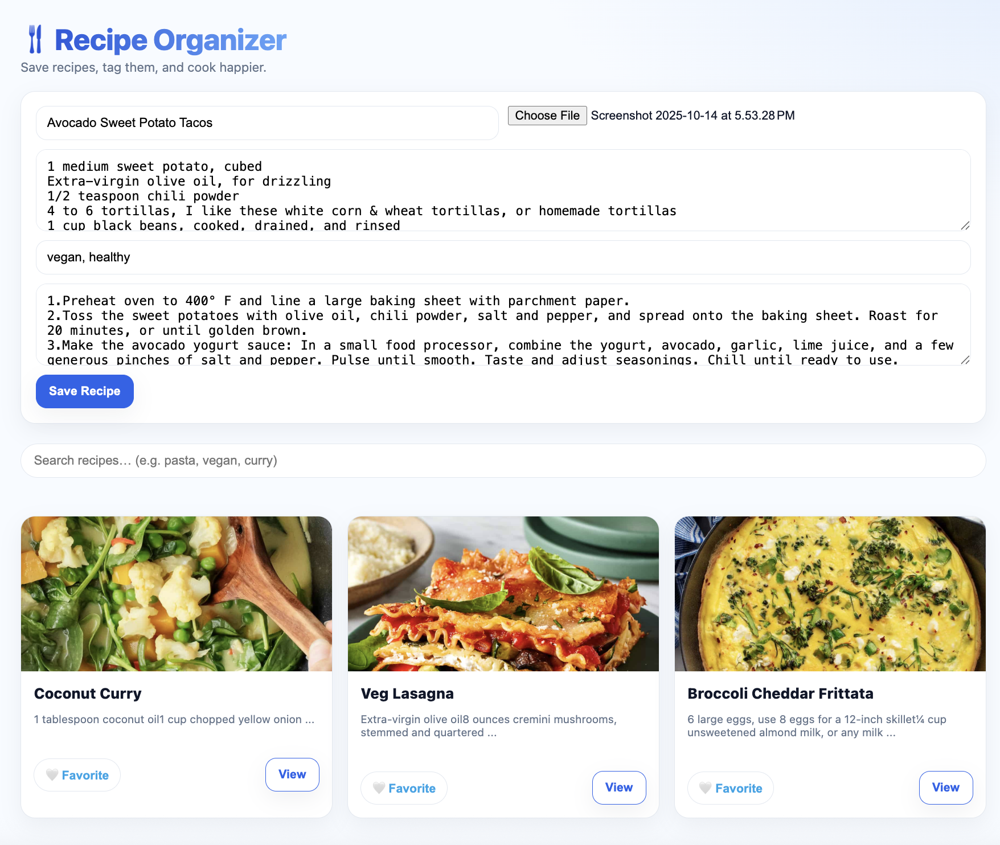
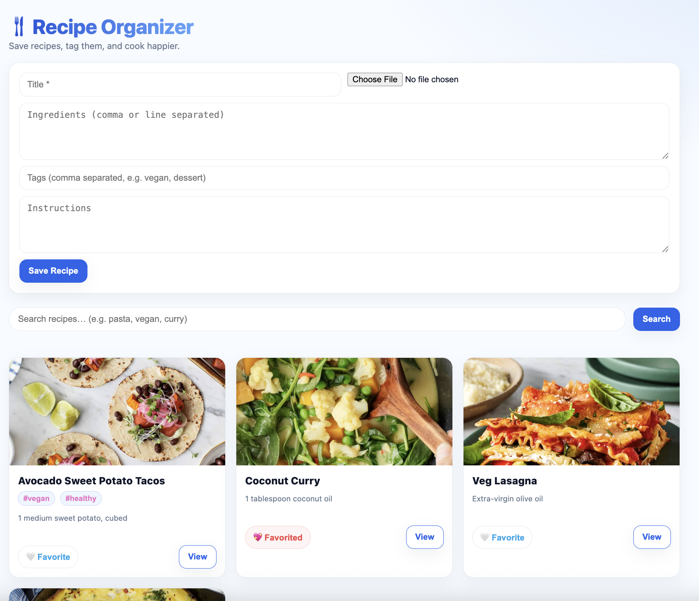

# 🍴 Recipe Organizer  
*A full-stack app(React + Node.js + Express.js + PostgreSQL) to save, tag, and search your favorite recipes — fast and beautifully.*

Recipe Organizer lets you create, browse, and manage your favorite dishes in one clean place.  
You can upload images, type ingredients and instructions, tag recipes (like **vegan**, **dessert**, **quick**), favorite them, and instantly filter by tag or search term.

---
| Add Recipe | | Home Recipe | Search Recipes | Recipe Modal |
|:--:|:--:|:--:|:--:|
|  ||  |   |  |

---

## 🧰 Tech Stack
| Layer | Technology |
|:--|:--|
| **Frontend** | React, Axios |
| **Backend** | Node.js, Express.js |
| **Database** | PostgreSQL |
| **File Uploads** | Multer |
| **UI/UX** | Custom CSS (bright, minimal UI) |
---
## ⚙️ Setup Instructions

### 🖥️ Backend (Server)
```bash
cd server
npm install 


createdb recipe_db
psql -d recipe_db < server/schema.sql

node index.js
```
---
Create a .env file in /server:

DATABASE_URL=postgres://postgres@localhost:5432/recipe_db
PORT=4000

### 💻 Frontend (Client)
```bash
cd ../client
npm install
npm start
```

Open http://localhost:3000
